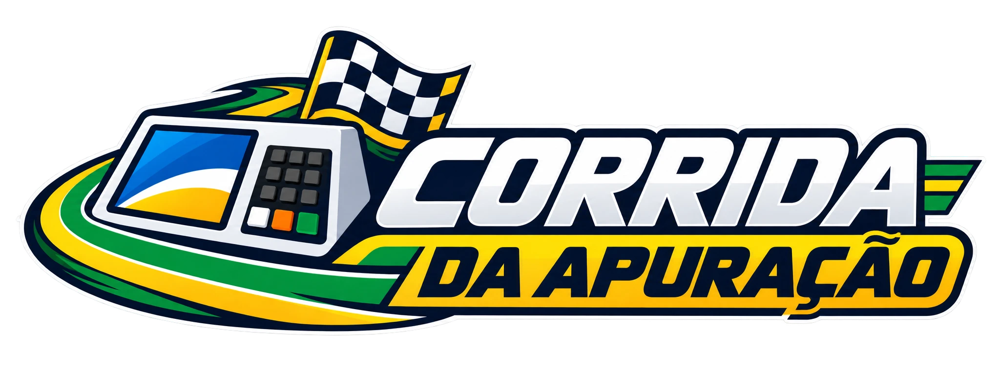

# Corrida da Apuração

<p align="center">
  
</p>

Uma corrida visual inspirada em jogos de kart para acompanhar a apuração presidencial. Cada piloto representa um candidato, e sua posição na pista acompanha sua porcentagem dos votos válidos.

**Acesse:** [corridaeleicao.vercel.app](https://corridaeleicao.vercel.app/)

## Recursos

- Pista animada com karts e posições atualizadas conforme os resultados.
- Classificação com candidatos, partidos e percentual de votos válidos.
- Indicador de seções totalizadas, fonte dos dados e horário da atualização.
- Dados oficiais do TSE quando disponíveis; placar de demonstração identificado enquanto isso.
- Simulação da apuração com dados de teste do TSE ou, se indisponíveis, dados fictícios identificados como simulação.
- Visões panorâmica, aérea e do líder, além de modo de tela cheia.
- Interface adaptada para desktop e dispositivos móveis.

## Como executar localmente

O projeto é estático, sem dependências ou etapa de build. Com Python 3 instalado, execute na pasta do projeto:

```bash
python3 -m http.server 8000
```

Abra [http://localhost:8000](http://localhost:8000) no navegador. É necessário estar conectado à internet para carregar os arquivos públicos do TSE. Se os dados não estiverem disponíveis, o jogo continua com o placar ilustrativo.

## Controles

- **← / →:** girar a câmera.
- **Pista / Aérea / Líder:** trocar o enquadramento.
- **F ou Tela cheia:** abrir ou sair da visualização imersiva.
- **Simular apuração:** iniciar a simulação.
- **Tempo real:** consultar os dados do TSE sem esperar o horário programado.

As opções também ficam disponíveis na barra de controles do modo de tela cheia.

## Dados eleitorais

O jogo consulta os arquivos públicos de resultados do TSE. A classificação usa os votos válidos dos candidatos; a porcentagem de seções totalizadas aparece separadamente. A posição na pista representa o percentual de votos válidos, não o percentual de seções apuradas.

Resultados de demonstração e simulações são identificados na interface e não devem ser interpretados como resultados oficiais. A documentação detalhada está em [`game.md`](game.md).

## Arquivos do projeto

- [`index.html`](index.html): página, metadados e estrutura da interface.
- [`style.css`](style.css): apresentação responsiva.
- [`game.js`](game.js): renderização da pista, controles, dados e simulação.
- [`logo.webp`](logo.webp): logo usada no cabeçalho e neste README.
- [`og-image.jpg`](og-image.jpg): imagem para compartilhamento em redes sociais.
- [`game.md`](game.md): conceito e detalhes de funcionamento.

## Tecnologias

HTML, CSS e JavaScript nativos, Canvas 2D e arquivos públicos JSON do TSE.
